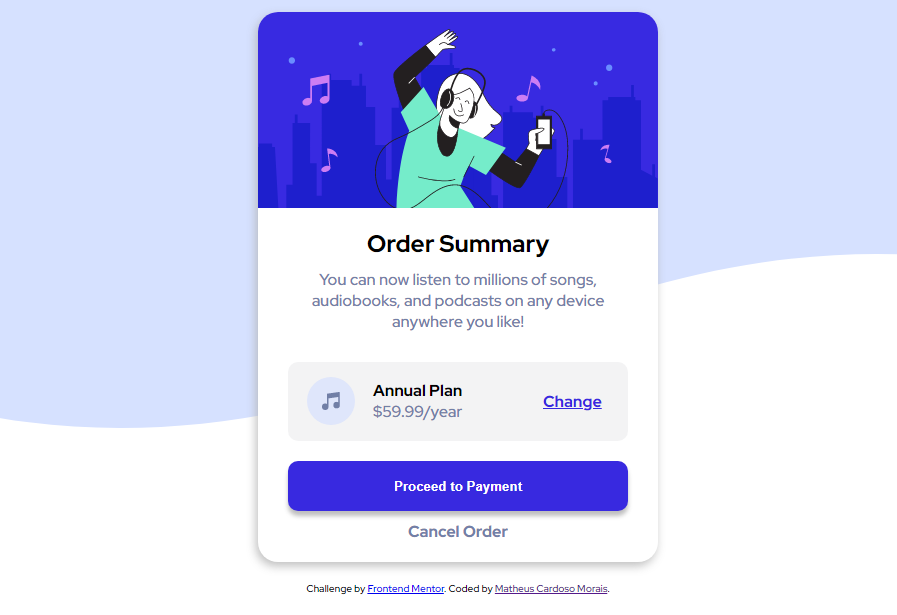

# Frontend Mentor - Order summary card solution

Esta é uma solução para o [desafio do cartão de resumo do pedido no Frontend Mentor] (https://www.front//or.io/challenges/order-summary-component-QlPmajDUj). Os desafios do Frontend Mentor ajudam você a melhorar suas habilidades de codificação ao construir projetos realistas.

### Projeto concluido

  
 

### Links

- Clique aqui -> [URL da soolução](https://matheuscmorais356.github.io/summaryCard)

### Construido com

- HTML5 
- CSS
- Flexbox
- CSS Grid

## Autor

- Git - [Matheus Cardsoso Morais](https://github.com/matheuscmorais356)
- Linkedin - [Matheus Cardoso](https://www.linkedin.com/in/matheus-cardoso-4442b5206)

